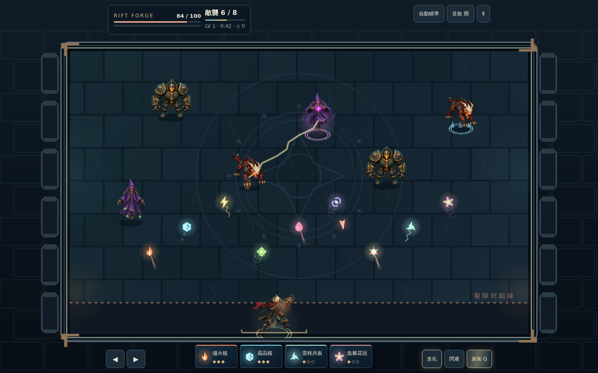
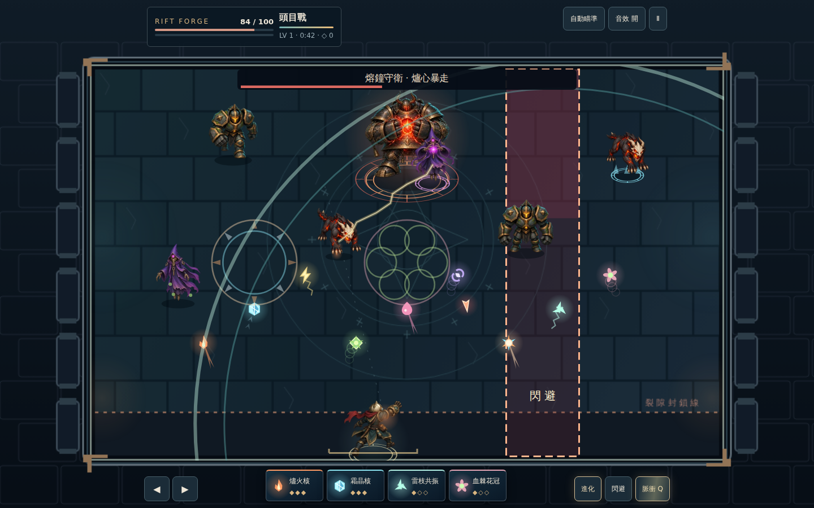
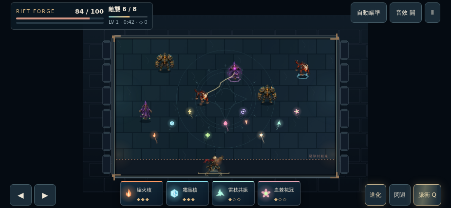

# Rift Forge 0.3 戰鬥美術驗證

受測程式提交：`ffaf384421ac06a8fdc23955e7bcb88cd9995dc2`。本目錄保存該提交的原始 CI 截圖及報告；後續證據文件提交不更動執行程式。

[GitHub Actions 驗證紀錄](https://github.com/darkmatter0915-lab/Zia/actions/runs/35987617637)：30 項 Node 規則測試、8 項 Chromium 測試與正式建置均通過，瀏覽器測試沒有失敗或重試通過的案例。

測試涵蓋三種尺寸的戰鬥／升級畫面、五張透明圖集及六個姿勢完整解碼、素材載入失敗後重試、暫停後移動停止、localStorage 重載舊存檔、頭目及進化特效、戰敗結算。美術場景透過 `?qa=1` 明確配置並凍結；不是自然遊玩的通關紀錄。

## 桌面戰鬥

## 頭目與進化特效

## 手機橫向尺寸

另附直向與升級畫面。直向保持原本戰場比例，仍建議橫向遊玩；這些是桌面 Chromium 的 viewport 測試，不是真機驗收。

## 效能限制

`render-benchmark.json` 的 70 敵人／140 球基準，只計 60 次 Canvas draw 呼叫耗時，包含排程和首次繪製抖動。完整／精簡模式平均約 5.04／4.82 ms，p95 約 60.10／59.10 ms，不能據此宣稱穩定 60 FPS。還需 iPhone/Safari、實體多指操作、長時間發熱、音訊、難度平衡與完整遊玩驗收。

## 動畫範圍

五種角色各六個原創生成關鍵姿勢，程式依移動、發射、施法、近戰臨界距離及受擊狀態播放，搭配死亡淡出、閃避殘影和元素效果。不是完整骨骼動畫或高幀數逐格動畫。本次是戰鬥美術升級，尚未完成商業發售驗收。
