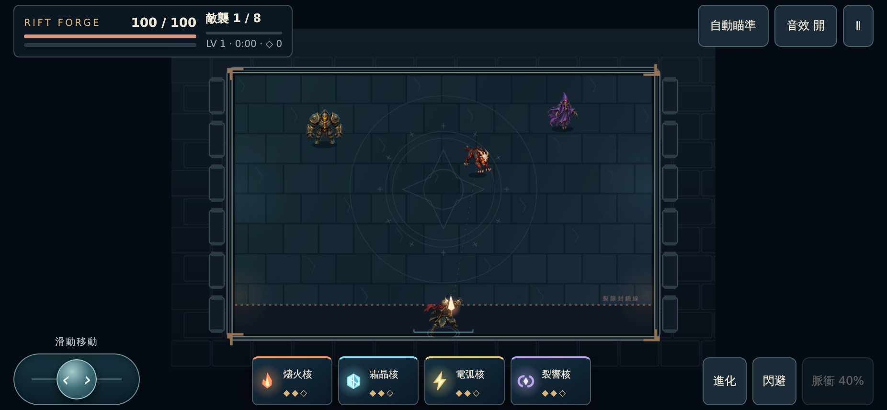
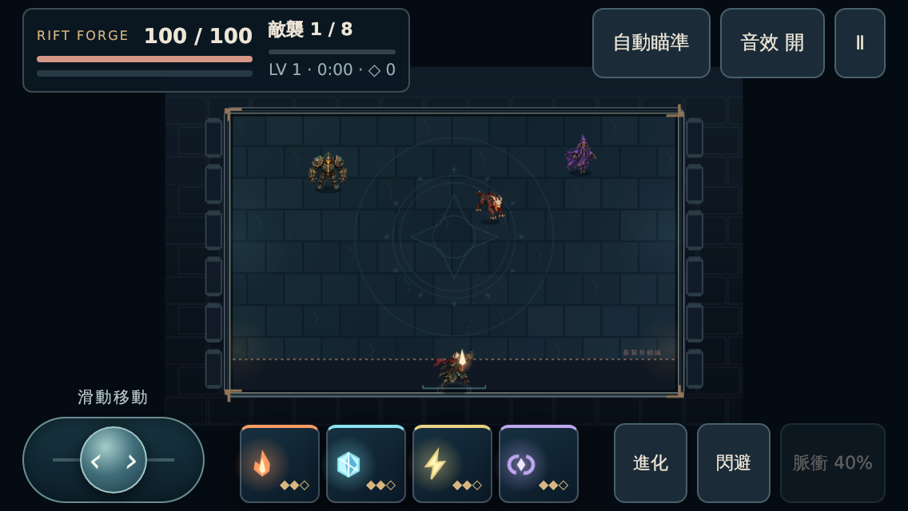
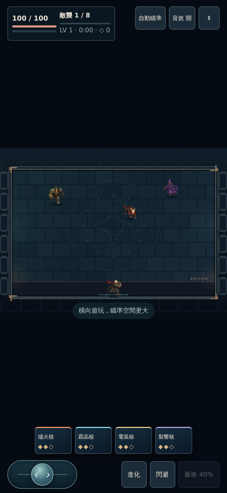

# Rift Forge 0.4：行動體驗

現有美術已透過 PR #5 合併部署。可直接開啟 [線上 0.3 美術版](https://darkmatter0915-lab.github.io/Zia/rift-forge/)；本分支接著製作 0.4 手機操作。

## 已完成

- 拇指滑桿提供方向與比例移速，也可切换為方向按鈕；設定會保存。
- 移動與瞄準各自管理指標；包含取消、失去捕捉與拖出範圍處理。
- 轉向及失焦自動暫停，恢復時不會沿用按住的操作。
- 戰場依 HUD、控制列和安全區安排，568×320 也保留操作空間。
- 暫停／選單停止重複繪製 Canvas 並暫停音訊運行；恢復後繼續。

## 驗證

受測提交 `267cb909b6c0c26e05e487e30d4711f33e14eaf2`，後續證據文件提交不變更執行程式。

[CI 紀錄](https://github.com/darkmatter0915-lab/Zia/actions/runs/35992611792)：30 項規則測試、28 項 Chromium／WebKit 測試、正式建置均通過；沒有跳過、失敗或重試才通過的案例。

測試含素材失敗重試、五組圖集解碼、舊存檔、升級／結算、原生滑鼠拖動與放開、雙指標分流、取消、轉向、操作偏好、音訊暫停及恢復、閒置期間繪製次數不再增加，以及 926×428、568×320、430×932、390×844 觸控版面。

雙指標案例為合成 PointerEvent。WebKit 是 CI 的桌面核心，不能等同 iPhone Safari 實機；安全區測試使用明確的 CSS 保留區。仍需實體多指操作、瀏海與地址列、長時間發熱／耗電、穩定 FPS 及音訊品質驗收。這些限制列在 [下一階段任務清單](tasks.md)。

以下使用實際 renderer，畫面由 QA 配置，不是自然進度的通關證明。

